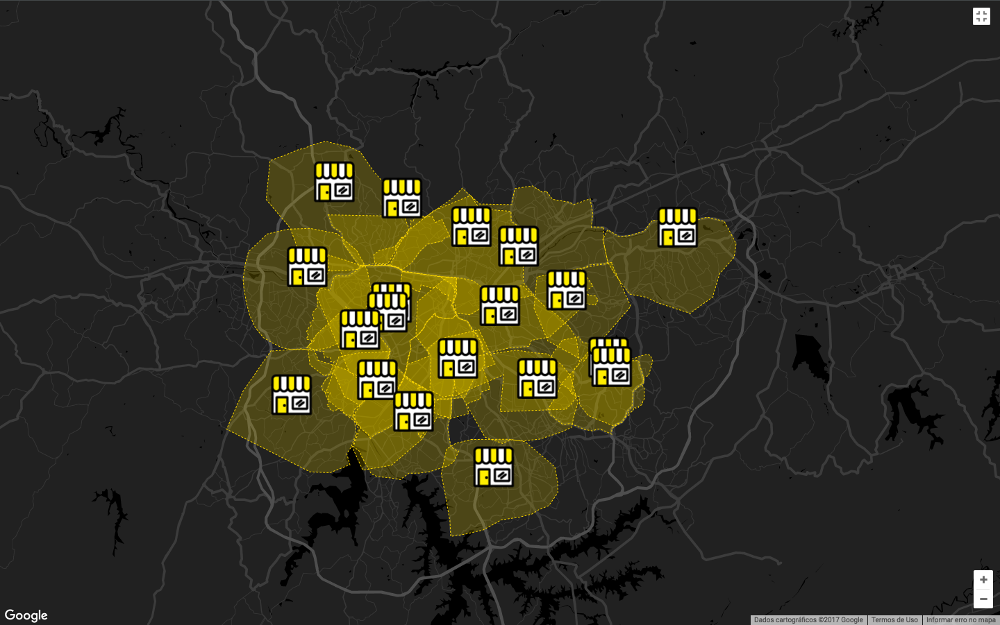

# Backend Challenge
> *Este arquivo também está disponível em português [aqui](backend_pt.md).*

In Zé we thrive to find our best partner to deliver beverages to our customers, providing the best and fastest service.
To achieve this our compute fleet deals with [GIS](https://en.wikipedia.org/wiki/Geographic_information_system) objects all the time.

When programming we try to follow a myriad of coding best practices and patterns (those you can read on books like Clean Code, Clean Architecture, The Pragmatic Programmer, Domain-Driven Design, Microservice Patterns, etc...). 
Since writing **good code is a must** on our daily basis we expect people that want to join our team to think alike. This code challenge is something we designed to find this awesome programmer.

## 1. What we want you to do

We expect you to develop a service that provides an API using _REST_ or _GraphQL_ that implements the three following features and respects the following technical requirements:

### 1.1. Create a partner:
Save in a database a partner defined by **all** the fields represented by the JSON and rules below:
```json
{
  "id": 1, 
  "tradingName": "Adega da Cerveja - Pinheiros",
  "ownerName": "Zé da Silva",
  "document": "1432132123891/0001",
  "coverageArea": { 
    "type": "MultiPolygon", 
    "coordinates": [
      [[[30, 20], [45, 40], [10, 40], [30, 20]]], 
      [[[15, 5], [40, 10], [10, 20], [5, 10], [15, 5]]]
    ]
  },
  "address": { 
    "type": "Point",
    "coordinates": [-46.57421, -21.785741]
  }
}
```

1. The `address` field follows the `GeoJSON Point` format (https://en.wikipedia.org/wiki/GeoJSON);
2. The `coverageArea` field follows the `GeoJSON MultiPolygon` format (https://en.wikipedia.org/wiki/GeoJSON);
3. The `document` must be a unique field;
4. The `id` must be a unique field, but not necessarily an integer;

You can use this [json](files/pdvs.json) file composed of hundreds of partner information to test your application — we do **not** expect these partners to be pre loaded in the database.
Below, you can have a look at how these partners might be represented in a map:


### 1.2. Load partner by id:
Return a specific partner by its `id` with all the fields presented above.

### 1.3. Search partner:
Given a specific location (coordinates `long` and `lat`), search the **nearest** partner **which the coverage area includes** the location.

### 1.4. Technical Requirements:
* The programming language and the database engine are entirely up to you;
* Your project must be **cross-platform**;
* Provide a documentation (README.md) file explaining how to execute your service **locally** and how to deploy it (*focus on simplicity, and don't forget that we should test your service on our own, without further assistance*).

## Evaluation Method

We will evaluate your code challenge based on some [system quality attributes](https://en.wikipedia.org/wiki/List_of_system_quality_attributes).
Some we consider a must-have, like **correctness**, and will be evaluated on a binary (works/follows or not) approach.
The others, since they are not objective, will not be able to fail your challenge alone.
These are all the quality attributes that we expect you address:
- **Correctness:** Your code must follow **all** the requirements presented on item [1.](#1-what-we-want-you-to-do);
- **Performance:** The more partners you can handle and the fastest you can query the best;
- **Testability:** How well tested your code is and how easy it is to add new tests to your code;
- **Maintainability:** How easy to add extra features to your code;
- **Separation of concerns:** (https://en.wikipedia.org/wiki/Separation_of_concerns)

## How to deliver it

- Push your code to a **Github private repository** and add @ze-engineering-code-challenge as a collaborator for it.
  This Github account (@ze-engineering-code-challenge) is solely used by Zé's engineers to download your code and review it.
- **Once you have finished the challenge, please follow these [instructions](https://github.com/ZXVentures/ze-code-challenges#how-to-deliver) to submit it to our team.**

Good luck!
